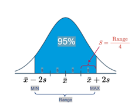
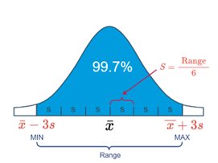
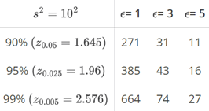
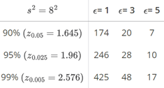
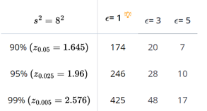
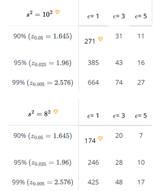
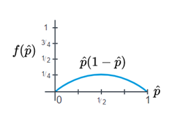
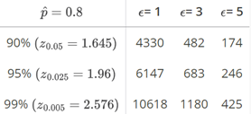
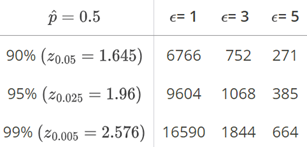

# Estimating a Mean 

**Example**

A researcher wants to estimate μ, the mean systolic blood pressure of adult Americans, with 95% confidence and error ϵ no larger than 3 mm Hg. How many adult Americans, n, should the researcher randomly sample to achieve her estimation goal?

**Answer**

The researcher's goal is to estimate μ so that the error is no larger than 3 mm Hg. (By the way, ϵ is typically called the maximum error of the estimate.) That is, her goal is to calculate a 95% confidence interval such that:

\[x ̅±ϵ=x ̅±3\]

Now, we know the formula for a $(1− α)100%$ confidence interval for a population mean μ is:

\[\bar{x} \pm t_{(α/2,n-1)} (s/√n)\]

So, it seems that a reasonable way to proceed would be to equate the terms appearing after each of the above ± signs, and solve for n. That is, equate:

\[ϵ=t_{(α/2,n-1)} (s/√n)\]

and solve for n. Multiplying through by the square root of n, we get:

\[ ϵ\sqrt{n} =t_{(α/2,n-1)} (s)\]

And, dividing through by ϵ and squaring both sides, we get:

\[n=\frac{\left( t_{\frac{\alpha}{2},n-1}\right)^2s^2}{ϵ^2} \]

Now, what's wrong with the formula we derived? Well... the t -value on the right side of the equation depends on n.

That's not particularly helpful given that we are trying to find n! We can solve that problem by simply replacing the t -value that depends on n with a Z -value that doesn't. After all, you might recall that as n increases, the t -distribution approaches the standard normal distribution. Doing so, we get:

\[n≈\frac{(z_{α/2}^2 ) s^2}{ϵ^2}\]

Before we make the calculation for our particular example, let's take a step back and summarize what we have just learned.

## Estimating a population mean μ

The sample size necessary for estimating a population mean μ with \( (1 - \alpha)100\% \) confidence and error no larger than \( \epsilon \) is given by:

\[ n = \frac{(z_{(\alpha/2)}^2 \cdot s^2)}{\epsilon^2} \]

Typically, the hardest part of determining the necessary sample size is finding \( s^2 \), that is, a decent estimate of the population variance. There are a few ways of obtaining \( s^2 \).

### Ways to Determine \( s^2 \)

- You can often get \( s^2 \), an estimate of the population variance from the scientific literature. After all, scientific research is typically not done in a vacuum. That is, what one researcher is studying and reporting in scientific journals is typically also studied and reported by several other researchers in various locations around the world. If you're in need of an estimate of the variance of the front leg length of red-eyed tree frogs, you'll probably be able to find it in a research paper reported in some scientific journal.

- You can often get \( s^2 \), an estimate of the population variance by conducting a small pilot study on 5-10 people (or trees or snakes or... whatever you're measuring).

- You can often get \( s^2 \), an estimate of the population variance by using what we know about the Empirical Rule, which states that we can expect 95% of the observations to fall in the interval:
  \[ \bar{x} \pm 2s \]

  Here's a picture that illustrates how this part of the Empirical Rule can help us determine a reasonable value of \( s \):

  

  That is, we could define the range of values as that which captures 95% of the measurements. If we do that, then we can work backwards to see that \( s \) can be determined by dividing the range by 4. That is:
  \[ s = \frac{\text{Range}}{4} = \frac{\text{Max} - \text{Min}}{4} \]

  When statisticians use the Empirical Rule to help a researcher arrive at a reasonable value of \( s \), they almost always use the above formula. That said, there may be occasions in which it is worthwhile using another part of the Empirical Rule, namely that we can expect 99.7% of the observations to fall in the interval:
  \[ \bar{x} \pm 3s \]

  Here's a picture that illustrates how this part of the Empirical Rule can help us determine a reasonable value of \( s \):

  

  In this case, we could define the range of values as that which captures 99.7% of the measurements. If we do that, then we can work backwards to see that \( s \) can be determined by dividing the range by 6. That is:
  \[ s = \frac{\text{Range}}{6} = \frac{\text{Max} - \text{Min}}{6} \]

## Example 1.2 (Continued)

A researcher wants to estimate \( \mu \), the mean systolic blood pressure of adult Americans, with 95% confidence and error \( \epsilon \) no larger than 3 mm Hg. How many adult Americans, \( n \), should the researcher randomly sample to achieve her estimation goal?

### Answer

If the maximum error \( \epsilon \) is 3, and the sample variance is \( s^2 = 10^2 \), we need:

\[ n = \frac{(1.96)^2 \cdot (10)^2}{3^2} = 42.7 \]

or 43 people to estimate \( \mu \) with 95% confidence. In general, when making sample size calculations such as this one, it is a good idea to change all of the factors to see what the "cost" in sample size is for achieving certain errors \( \epsilon \) and confidence levels \( (1 - \alpha) \). Doing that here, we get:

we can also change the estimate of the variance. For example, if we change the sample variance to $s^2=8^2$, then the necessary sample sizes for various errors ϵ and confidence levels (1− α) become:

## Factors Affecting the Sample Size

If we take a look back at the formula for the sample size:

\[ n = \frac{(z_{(\alpha/2)}^2 \cdot s^2)}{\epsilon^2} \]

we can make some generalizations about how each of three factors, namely the standard deviation \( s \), the confidence level \( (1 - \alpha)100\% \), and the error \( \epsilon \), affect the necessary sample size.

As the confidence level \( (1 - \alpha)100\% \) increases, the necessary sample size increases. That's because as the confidence level increases, the \( Z \)-value, which appears in the numerator of the formula, increases. Again, you can see an example of this generalization from some of the numbers generated in that last example.

As the error \( \epsilon \) decreases, the necessary sample size \( n \) increases. That's because the error epsilon term appears in the denominator. You can see an example of this generalization from some of the numbers generated in that last example.

As the sample standard deviation \( s \) increases, the necessary sample size increases. That's because the standard deviation \( s \) appears in the numerator of the formula. Again, you can see an example of this generalization from some of the numbers generated in that last example.

As the sample standard deviation s increases, the necessary sample size increases. That's because the standard deviation s appears in the numerator of the formula. Again, you can see an example of this generalization from some of the numbers generated in that last example:

## Estimating a Proportion for a Large Population

**Example**

A pollster wants to estimate \( p \), the true proportion of all Americans favoring the Democratic candidate with 95% confidence and error \( \epsilon \) no larger than 0.03. 

How many people should he randomly sample to achieve his goals?

**Answer**

We'll tackle this problem just as we did for finding the sample size necessary to estimate a population mean. First, note that the pollster's goal is to estimate the population proportion \( p \) so that the error is no larger than 0.03. That is, the goal is to calculate a 95% confidence interval such that:

\[ \hat{p} \pm \epsilon = \hat{p} \pm 0.03 \]

But, we know the formula for a \( (1 - \alpha)100\% \) confidence interval for a population proportion is:

\[ \hat{p} \pm z_{(\alpha/2)} \sqrt{\frac{\hat{p}(1-\hat{p})}{n}} \]

So, just as we did on the previous page, we'll proceed by equating the terms appearing after each of the above \( \pm \) signs, and solve for \( n \). That is, equate:

\[ \epsilon = z_{(\alpha/2)} \sqrt{\frac{\hat{p}(1-\hat{p})}{n}} \]

and solve for \( n \). Multiplying through by the square root of \( n \), we get:

\[ \sqrt{\epsilon \cdot n} = z_{(\alpha/2)} \sqrt{\hat{p}(1-\hat{p})} \]

And, dividing through by \( \epsilon \) and squaring both sides, we get:

\[ n = \frac{z^2_{(\alpha/2)} (\hat{p}(1-\hat{p}))}{\epsilon^2} \]

Again, before we make the calculation for our particular example, let's take a step back and summarize the formula that we have just derived.

### Estimating a population proportion \( p \)

The sample size necessary for estimating a population proportion \( p \) of a large population with \( (1-\alpha)100\% \) confidence and error no larger than \( \epsilon \) is:

\[ n = \frac{z^2_{(\alpha/2)} (\hat{p}(1-\hat{p}))}{\epsilon^2} \]

Just as we needed to have a decent estimate, \( s^2 \), of the population variance when calculating the sample size necessary for estimating a population mean \( \mu \), we need to have a good estimate, \( \hat{p} \), of the population proportion when calculating the sample size necessary for estimating a population proportion \( p \). Strange, I know... but there are at least two ways out of this conundrum.

#### Ways to Determine \( \hat{p}(1-\hat{p}) \)

- You can use your prior knowledge (previous polls, perhaps?) about \( \hat{p} \).
- You can set \( \hat{p}(1-\hat{p}) = 1/4 \), its maximum when \( \hat{p} = 1/2 \).

**Example (Continued)**

A pollster wants to estimate \( p \), the true proportion of all Americans favoring the Democratic candidate with 95% confidence and error \( \epsilon \) no larger than 0.03. How many people should he randomly sample to achieve his goals?

**Answer**

If the maximum error \( \epsilon \) is 0.03, and the sample proportion is 0.8, we need to survey:

\[ n = \frac{(1.96)^2 (0.8)(0.2)}{0.03^2} = 682.95 \]

or 683 people to estimate \( p \) with 95% confidence. Again, when making sample size calculations such at this one, it is a good idea to change all of the factors to see what the "cost" is in sample size for achieving certain errors \( \epsilon \) and confidence levels \( (1-\alpha) \). Doing that here, we get:

We, of course, can also change the sample proportion. For example, if we change the sample proportion to 0.5, then we need to survey:

\[ n = \frac{(1.96)^2 (0.5)(0.5)}{0.03^2} = 1067.1 \]

or 1068 people to estimate \( p \) with 95% confidence. The two calculations in this example illustrate how useful it is to have some idea of the magnitude of the sample proportion. In one case, if the proportion is close to 0.80, then we'd need as few as 680 people. On the other hand, if the proportion is close to 0.50, then we'd need as many as 1070 people. That difference in necessary sample size sure argues for a small pilot study in advance of the larger survey.

By the way, just as we did for the case in which the sample proportion was 0.8, we can change the factors to see what the "cost" is in sample size for achieving certain errors \( \epsilon \) and confidence levels \( (1 - \alpha) \). Doing that here, we get:

